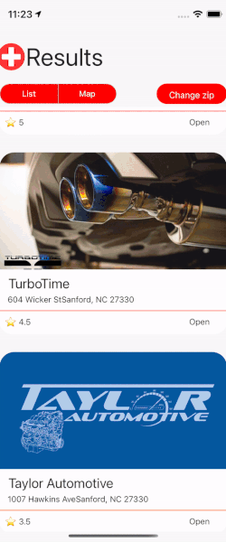
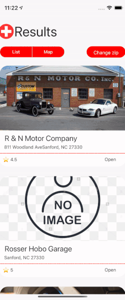

<h1 align="center">
  👨🏽‍🔧 <em>Mechanic Finder</em>
</h1>

<!--    -->

## :calling: About

Mechanic Finder is an online mechanic finder app that displays Mechanics that are within the provided zip code area. Core features include location searching with zip code, which displays a list of mechanics. Users will be provided with the address of the Mechanic shop and will be automatically taken to their GPS application. Users will be able to see ratings and reviews of the mechanic shop to make the right choice. 

## :eyes: Preview

### :1234: Instructions to Preview 

1. Head over to the Google Play Store and download the Expo Go app

   - Link: https://play.google.com/store/apps/details?id=host.exp.exponent

2. Open the [Expo Go](https://play.google.com/store/apps/details?id=host.exp.exponent 'Expo Go') app or simply go to the [Expo website](https://expo.io/ 'Expo') and follow the instructions to register for an Expo account

   - Note: _**You will need an account on Expo in order to view the app!**_

3. After completing step 1 and 2 above, open your device camera and scan the provided QR code in the link below:

   - Link: my_link_goes here (_**Published version of app hosted on Expo**_)

4. After scanning the QR code, the Expo Go app will automatically load up the app

   - Note: _**If this is your first time opening the app, it might take a while to load up. Please be patient!**_

## :gear: Core Tech Stack

👉&nbsp; [Project Architecture Diagram](https://lucid.app/lucidchart/invitations/accept/inv_6fab6816-4e33-4ab2-9039-1cab4f972b3d 'YumMeals App Architecture Diagram')

- :arrow_up_small:&nbsp; [Expo](https://expo.io/ 'Expo')
- :electron:&nbsp;[React Native](https://reactnative.dev/ 'React Native')
- :link:&nbsp; [React Navigation](https://reactnavigation.org/ 'React Navigation')
- :performing_arts:&nbsp; [Styled Components](https://styled-components.com/ 'Styled Components')
- :world_map:&nbsp; [React Native Maps](https://github.com/react-native-maps/react-native-maps/ 'React Native Maps')
- :electric_plug:&nbsp; [Yelp Fusion](https://www.yelp.com/fusion/ 'Yelp Fusion')

## :sparkles: Main Features
- Location search through cities around the world to discover mechanics.

## :camera_flash: Screenshots

    
    
    
    
    
    

